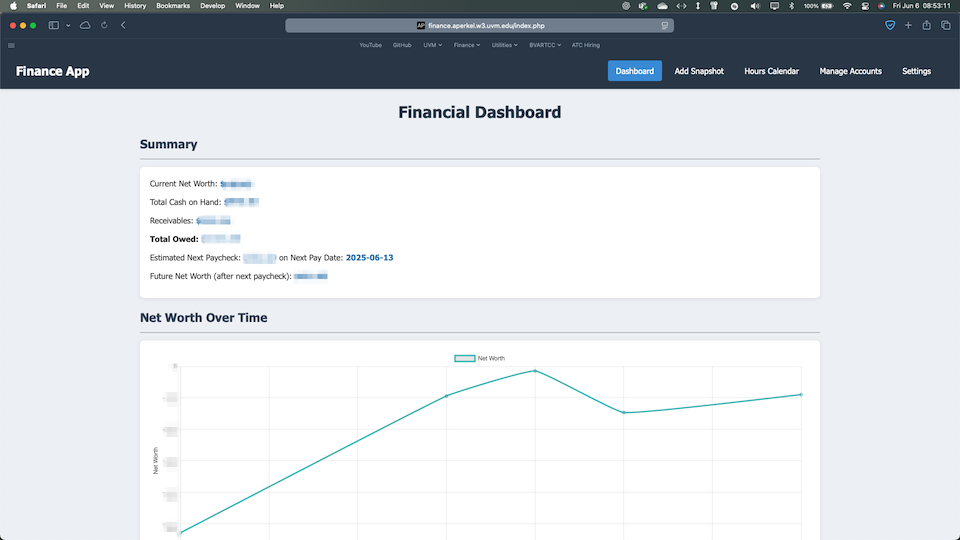

# Finance Tracker



## Project Overview
This web application is a comprehensive tool designed for personal finance management and time tracking. It helps users gain insights into their financial health by tracking net worth, managing accounts, and providing financial summaries. Additionally, it allows users to log and visualize their work hours, offering a clear view of their time investment.

## Features
Based on the codebase, here are the key functionalities:
- **Financial Dashboard:** Provides a snapshot of your overall financial situation, including net worth, cash balances, receivables, and outstanding debts.
- **Net Worth Tracking:** Monitors your net worth progression over time, visualized through an intuitive chart.
- **Account Management:** Allows for the addition, modification, and tracking of various financial accounts (e.g., savings, checking, credit cards, investments).
- **Time Logging:** Enables users to record their work hours efficiently.
- **Calendar View:** Displays logged work hours in a calendar format, providing a clear overview of time spent.
- **Financial Summaries:** Offers detailed reports and summaries of financial data.
- **Payday Calculation:** Helps estimate upcoming paychecks and track income.

## Prerequisites
To run this application, you will need the following software installed on your system:
- PHP (version 8.1 or higher recommended)
- MySQL (or a compatible version of MariaDB)
- Composer (for managing PHP dependencies)
- A web server (such as Apache or Nginx)

## Installation

1.  **Clone the repository:**
    ```bash
    git clone <repository-url> 
    cd <repository-directory>
    ```
    (Replace `<repository-url>` with the actual URL of the repository and `<repository-directory>` with the name of the directory created by cloning)

2.  **Install dependencies:**
    Run Composer to install the required PHP packages.
    ```bash
    composer install
    ```

3.  **Set up the database:**
    *   **Create a database:** You'll need to create a MySQL database for the application. You can do this using a tool like phpMyAdmin or via the MySQL command line.
        ```sql
        CREATE DATABASE your_database_name;
        ```
        (Replace `your_database_name` with your preferred name)
    *   **Import schema:** Import the database structure using the `finance_schema.sql` file.
        ```bash
        mysql -u your_username -p your_database_name < database/finance_schema.sql
        ```
        (Replace `your_username` and `your_database_name` accordingly)
    *   **Import initial data (optional):** If you want to start with some sample data, import the `initial_data.sql` file.
        ```bash
        mysql -u your_username -p your_database_name < database/initial_data.sql
        ```
        (Replace `your_username` and `your_database_name` accordingly)

## Configuration

This application uses a `.env` file to manage environment-specific settings, such as database credentials.

1.  **Create the `.env` file:**
    You will need to create a `.env` file manually in the project root (e.g., `/app/.env` if your project is cloned into `/app`).

2.  **Set Environment Variables:**
    Open the `.env` file and set the following variables for your database connection:
    *   `DBNAMEFINANCE`: The name of your MySQL database.
    *   `DBUSER`: The username for accessing the database.
    *   `DBPASS`: The password for the database user.

    Example `.env` file content:
    ```
    DBNAMEFINANCE="your_database_name"
    DBUSER="your_username"
    DBPASS="your_password"
    ```
    (Replace with your actual database credentials)

3.  **Database Host:**
    Please note that the database host is currently hardcoded as `webdb.uvm.edu` in the `src/db.php` file. This is not configurable via the `.env` file in the current setup. If you need to use a different database host, you will need to modify this file (`src/db.php`) directly.

## Usage

1.  **Accessing the Application:**
    *   Configure your web server (e.g., Apache, Nginx) to point its document root to the `src` directory of the project.
    *   Open your web browser and navigate to the application. If you are running it locally, the URL will typically be something like `http://localhost/src/` or `http://localhost/your-project-directory/src/` (if you cloned it into a subdirectory of your web server's main htdocs/www folder).

2.  **Navigating Main Features:**
    Once the application is open in your browser:
    *   **Financial Dashboard:** The main dashboard (`index.php`) provides an overview of your financial status, including net worth and account summaries.
    *   **Logging Hours:** You can log your work hours via the "Log Hours" section (likely `log_hours.php`).
    *   **Managing Accounts:** Add, edit, or remove your financial accounts through the "Manage Accounts" page (`manage_accounts.php`).
    *   **Calendar View:** View your logged hours visually on a calendar by accessing the "Calendar Hours" page (`calendar_hours.php`).
    *   **Net Worth Snapshot:** Add a new net worth snapshot via `add_snapshot.php`.
    *   **Settings:** Configure application settings, if available, through `settings.php` or `admin_settings.php`.

## Contributing

We welcome contributions to enhance the functionality and usability of this application! If you'd like to contribute, please follow these general steps:

1.  **Fork the Repository:**
    Start by forking the main repository to your own GitHub account.

2.  **Create a Branch:**
    Create a new branch in your forked repository for your specific feature, bug fix, or improvement. Choose a descriptive branch name (e.g., `feature/new-reporting-module`, `fix/login-error`).
    ```bash
    git checkout -b your-branch-name
    ```

3.  **Make Your Changes:**
    Implement your changes, additions, or fixes in your branch. Ensure your code is clear, well-commented where necessary, and adheres to the existing coding style if possible.

4.  **Test Your Changes:**
    Test your changes thoroughly to ensure they work as expected and do not introduce new issues.

5.  **Submit a Pull Request:**
    Once you are happy with your changes, push your branch to your forked repository and then open a pull request from your branch to the `main` (or `develop`) branch of the original repository. Provide a clear description of the changes you've made in the pull request.

## License

This project is licensed under the MIT License.

For the full license text, please see the [LICENSE](LICENSE) file in the repository.